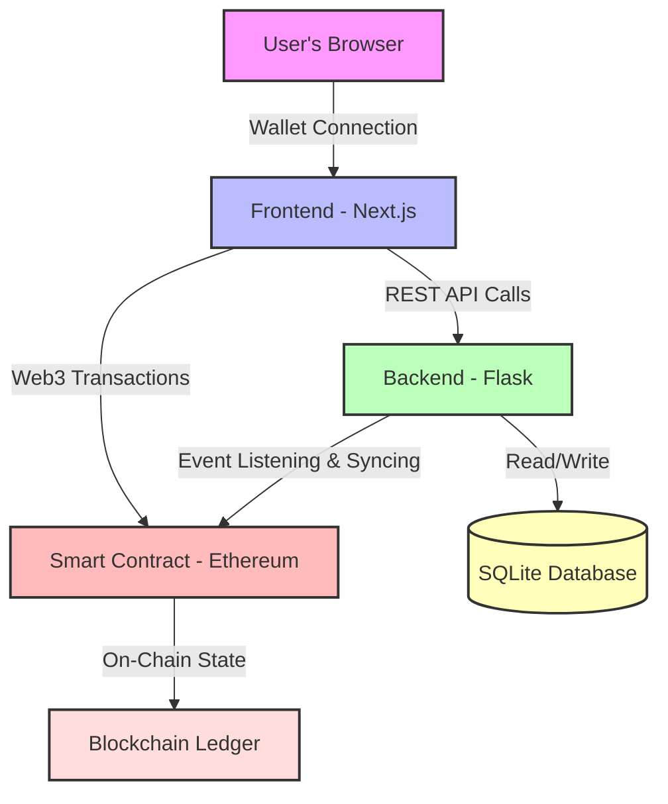

# Singapore Major Fan Consensus Protocol: Rally Behind Your Champions

## 🏆 About the 2026 Singapore CS2 Major

The **2026 Counter-Strike 2 Major Championship** is coming to Singapore, marking a historic moment for the Asian esports scene. As one of the most prestigious tournaments in competitive gaming, the Major will bring together the world's elite CS2 teams to compete for glory in Southeast Asia's vibrant gaming hub.

This tournament represents more than just competition - it's a celebration of the global Counter-Strike community's passion, dedication, and sportsmanship. Singapore's world-class infrastructure and thriving gaming culture make it the perfect stage for this landmark event.

---

> **Unite the CS2 Community Through Blockchain-Powered Team Support**
>
> In the vibrant world of competitive Counter-Strike, every fan's voice matters. Singapore Major Fan Consensus Protocol transforms team support into a transparent, community-driven celebration where fans rally behind their champions using Sepolia testnet credits. Built on Ethereum's public blockchain, every show of support becomes part of an immutable record that strengthens the bond between CS2 players and the Web3 developer community.

**Our Mission:** Using free Sepolia ETH as symbolic credits, we share in our champions' honor and channel this collective energy toward empowering Web3 developers to build bridges with the Steam ecosystem. Together, we're creating a thriving, interconnected community where CS players and blockchain innovators collaborate to shape the future of competitive gaming.

---

### 🟢 Live Platform Status

[](https://major.hezhili.online/)

**Visit the platform:** [https://major.hezhili.online/](https://major.hezhili.online/)

## Core Features

- **Community-Powered Support System**: Every show of support is recorded as a blockchain transaction, creating a transparent, verifiable record of our collective rally behind the teams we believe in.
- **Real-time Victory Vault**: Watch the community's collective support grow as fans worldwide unite behind their champions, all powered by free Sepolia testnet credits.
- **Live Blockchain Transparency**: Our backend continuously monitors the blockchain, providing real-time updates on team support levels and community engagement statistics.
- **Weapon Equivalents Visualization**: See the Victory Vault's value represented through iconic CS2 skins like the AWP | Dragon Lore, bridging the gaming and blockchain worlds in a tangible way.
- **Top Champions Leaderboard**: Celebrate the most dedicated supporters with a live-updating leaderboard that showcases community leaders who rally hardest for their teams.
- **Seamless Web3 Experience**: Connect effortlessly with MetaMask and other Web3 wallets through RainbowKit, making blockchain participation accessible to every CS2 fan.

---

## The Technology Stack

This project bridges the CS2 gaming community with Web3 technology, creating an educational platform that demonstrates how blockchain can enhance fan engagement while using free testnet resources.

| Category       | Technology                               | Description                                                                                |
| :------------- | :--------------------------------------- | :----------------------------------------------------------------------------------------- |
| **Frontend**   | Next.js, React, TypeScript, Tailwind CSS | A high-performance interface designed for seamless fan interaction and team support.       |
| **Web3 Libs**  | Wagmi, RainbowKit, Viem                  | Modern Web3 tools empowering CS2 fans to participate in blockchain-based community events. |
| **Backend**    | Python, Flask, SQLAlchemy                | A reliable data layer synchronizing blockchain activity with community statistics.         |
| **Blockchain** | Ethereum (Sepolia Testnet), Web3.py      | Free testnet infrastructure enabling risk-free exploration of Web3 for CS2 enthusiasts.    |
| **Deployment** | Render.com, Gunicorn                     | Scalable cloud infrastructure ensuring reliable access for the global CS2 community.       |

---

## System Architecture

The system operates on a three-tiered architecture designed for reliability, scalability, and decentralization.



### Data Flow

1.  **The Smart Contract**: Deployed on Ethereum's Sepolia testnet, the contract serves as the transparent foundation for our community support system. It manages the Victory Vault using free testnet credits, implements fair distribution logic, and ensures every participant can verify the process.
2.  **The Backend (Flask & Web3.py)**: This service bridges blockchain technology with accessible data visualization. It monitors the blockchain for community support activities, indexes participation into a local database, and powers the API that delivers real-time statistics, leaderboards, and team engagement metrics to all fans.
3.  **The Frontend (Next.js)**: The community-facing platform where CS2 fans connect their wallets and rally behind their chosen teams. It delivers an engaging experience that makes blockchain participation intuitive and rewarding, transforming complex Web3 concepts into familiar fan support actions.

---

## Project Structure

```
Singapore-Major-Fan-Consensus/
│
├── backend/                      # Flask backend service
│   ├── app.py                    # Main application logic
│   ├── abi.json                  # Smart contract interface
│   ├── requirements.txt          # Python dependencies
│   ├── gunicorn.conf.py          # Production server config
│   ├── reset_db.py               # Database initialization script
│   └── .env                      # Environment configuration (RPC, Contract Address, API Keys)
│
├── frontend/                     # Next.js frontend application
│   ├── src/
│   │   ├── app/                  # Next.js app router pages
│   │   ├── components/           # Reusable React components
│   │   ├── hooks/                # Custom React hooks (API calls)
│   │   └── lib/                  # Utility functions and configurations
│   ├── public/                   # Static assets (team logos, images)
│   ├── package.json              # Node.js dependencies
│   └── next.config.ts            # Next.js configuration
│
└── README.md                     # This file
```

---

## Deployment

This project is designed for a separated frontend and backend deployment, a standard practice for modern web applications that ensures scalability and security. For a comprehensive, step-by-step guide, please refer to the documents below.

### Deployment Guides

- **[Deployment Sequence](DEPLOY_SEQUENCE.md)**: The complete, ordered guide for deploying all services.
- **[Architectural Reasoning](WHY_SEPARATE_DEPLOY.md)**: An explanation of the benefits of this deployment strategy.
- **[Backend Deployment Guide](DEPLOYMENT.md)**: Detailed instructions for deploying the Flask backend on Render.
- **[Frontend Deployment Guide](FRONTEND_DEPLOY.md)**: Detailed instructions for deploying the Next.js frontend on Render.

### Quick Deployment Overview

| Service    | Platform   | Technology       | URL Pattern                                                   |
| :--------- | :--------- | :--------------- | :------------------------------------------------------------ |
| Backend    | Render.com | Flask + Gunicorn | `https://singapore-major-fan-consensus-backend.onrender.com`  |
| Frontend   | Render.com | Next.js          | `https://singapore-major-fan-consensus-frontend.onrender.com` |
| Blockchain | Sepolia    | Ethereum Testnet | Accessible via RPC endpoint                                   |

---

## Getting Started (Local Development)

### Prerequisites

- **Node.js** (v18+) and **npm**
- **Python** (3.10+) and **uv** (or pip)
- **MetaMask** or another Web3 wallet with Sepolia ETH

### Backend Setup

```bash
cd backend
uv venv                       # Create a virtual environment
source .venv/bin/activate     # Activate it (macOS/Linux)
uv pip install -r requirements.txt  # Install dependencies
cp .env.example .env          # Create your .env file
# Edit .env with your RPC_URL, CONTRACT_ADDRESS, ETHERSCAN_API_KEY
uv run python reset_db.py     # Initialize the database
uv run python app.py          # Start the Flask server
```

Backend will be available at `http://127.0.0.1:5001`

### Frontend Setup

```bash
cd frontend
npm install                   # Install dependencies
# Create .env.local and set NEXT_PUBLIC_BACKEND_URL=http://127.0.0.1:5001/api
npm run dev                   # Start the Next.js dev server
```

Frontend will be available at `http://localhost:3000`

---

## Key Technical Highlights

### Blockchain Interaction

- **Smart Contract Functions**: Our platform interacts with a community support smart contract deployed on Sepolia testnet. Core functions include `predict(uint256 _teamId)` for rallying behind teams and `getTeams()` for retrieving team data - all powered by free testnet credits.
- **Event Listening**: The backend continuously monitors blockchain activity using the Etherscan API, detecting new community support actions in real-time and celebrating participant contributions through database updates.
- **Web3 Wallet Integration**: Fans connect their MetaMask wallets via RainbowKit, experiencing seamless blockchain participation that feels as natural as traditional fan engagement platforms.

### Real-Time Community Updates

- **Dual-Source Synchronization**: Our system updates community statistics both through blockchain event monitoring and immediate frontend triggers after successful support actions. This ensures fans see their contributions reflected instantly, celebrating every participant's impact.
- **Live Weapon Price Data**: CS2 weapon prices are fetched from real-time market APIs and converted to USD, making the "Weapon Equivalents" feature both educational and culturally relevant - showing how testnet credits translate to real gaming economy values.

### Modern Frontend Patterns

- **Type Safety**: TypeScript is used throughout the frontend, with strict type definitions for all API responses and component props.
- **Data Fetching**: TanStack Query (React Query) is used for efficient data fetching, caching, and background updates with configurable refetch intervals.
- **UI/UX**: Framer Motion provides smooth animations, while Radix UI components ensure accessible and robust UI elements.

---

## Join Our Mission

This platform demonstrates how Web3 technology can unite gaming communities and empower developers to build meaningful connections between traditional gaming platforms like Steam and the blockchain ecosystem. We welcome contributions from:

- **CS2 Players**: Share feedback on fan engagement features
- **Web3 Developers**: Help us refine blockchain integration patterns
- **Community Builders**: Suggest ways to strengthen player-developer collaboration

If you have ideas for improvements or want to join our mission, please open an issue or submit a pull request.

---

## Educational Mission

This project serves as an educational bridge between gaming and blockchain communities. By using free Sepolia testnet credits, we eliminate financial barriers and create a risk-free environment where:

- CS2 fans learn Web3 concepts through familiar team support mechanics
- Web3 developers explore Steam ecosystem integration opportunities
- Both communities collaborate on building the future of competitive gaming infrastructure

All participation uses testnet resources - no real financial investment required.

---

## Community & Support

Questions about Web3 integration? Curious about Steam-blockchain bridges? Want to collaborate on CS2 community projects?

Open an issue on this repository and join the conversation. Together, we're building connections that will help Web3 developers create more inclusive, engaging experiences for the global CS2 community.

---

**Built with dedication to unite CS2 players and Web3 developers in creating a thriving, collaborative gaming ecosystem.**

**Every Sepolia credit shared represents a step toward a more connected, empowered community where gaming passion meets blockchain innovation.**
