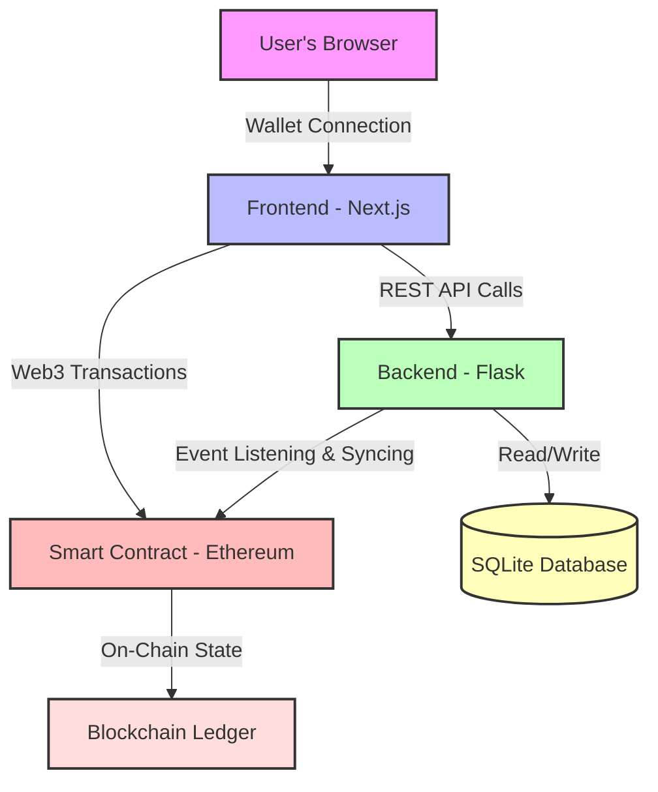

# Singapore Major Bet: A Decentralized CS2 Tournament Betting Platform

> In the high-stakes world of competitive Counter-Strike, transparency and fairness are paramount. Singapore Major Bet reimagines tournament wagering by leveraging the power of Web3, creating a fully decentralized, transparent, and engaging betting experience built on the Ethereum blockchain.

This platform moves beyond traditional betting systems by recording every wager as a transaction on a public ledger. This ensures unparalleled transparency, where prize pools are governed by smart contracts and every participant can verify the integrity of the system.

---

## Core Features

-   **Decentralized Betting Engine**: All bets are processed as blockchain transactions, ensuring security and eliminating the need for a trusted third party.
-   **Real-time Prize Pool**: Watch the total prize pool grow in real-time as fans from around the world back their favorite teams.
-   **Live On-Chain Data**: Utilizes a robust backend to monitor the blockchain, synchronizing every bet to provide up-to-the-minute statistics and team standings.
-   **Dynamic Visualizations**: The "Prize Pool Power" feature translates the current prize pool's value into iconic, high-value CS2 skins like the AWP | Dragon Lore, offering a compelling, tangible representation of the stakes.
-   **Top Bettors Leaderboard**: A live-updating leaderboard showcases the top participants, fostering a competitive and engaging community environment.
-   **Seamless Wallet Integration**: Effortlessly connect with popular Web3 wallets like MetaMask through RainbowKit for a smooth and secure user experience.

---

## The Technology Stack

This project is a full-stack decentralized application, combining a modern web frontend, a robust data-serving backend, and the immutable logic of blockchain smart contracts.

| Category      | Technology                                                                                                  | Description                                                                 |
| :------------ | :---------------------------------------------------------------------------------------------------------- | :-------------------------------------------------------------------------- |
| **Frontend**  | Next.js, React, TypeScript, Tailwind CSS                                                                    | A high-performance, type-safe, and beautifully styled user interface.       |
| **Web3 Libs** | Wagmi, RainbowKit, Viem                                                                                     | A powerful and modern toolset for interacting with the Ethereum blockchain. |
| **Backend**   | Python, Flask, SQLAlchemy                                                                                   | A lightweight and powerful backend for serving data and syncing with the chain. |
| **Blockchain**| Ethereum (Sepolia Testnet), Web3.py                                                                         | The foundation of the decentralized application, ensuring security and trust. |
| **Deployment**| Render.com, Gunicorn                                                                                        | A modern, scalable infrastructure for deploying both frontend and backend services. |

---

## System Architecture

The system operates on a three-tiered architecture designed for reliability, scalability, and decentralization.



### Data Flow

1.  **The Smart Contract**: Deployed on the Ethereum blockchain, the contract is the ultimate source of truth. It securely holds all funds, defines the betting logic, and ensures that payouts are handled according to predetermined rules.
2.  **The Backend (Flask & Web3.py)**: This service acts as a vital bridge. It runs a persistent listener that monitors the blockchain for new betting transactions. It then indexes this data into a local database (SQLite) to power the API, providing the frontend with aggregated statistics, leaderboards, and team-specific data without requiring every user to query the blockchain directly.
3.  **The Frontend (Next.js)**: The user-facing application that consumes data from the backend API. It provides a rich, interactive experience, handles wallet connections, and allows users to construct and send their betting transactions to the smart contract.

---

## Project Structure

```
Singapore-Major-Bet/
│
├── backend/                      # Flask backend service
│   ├── app.py                    # Main application logic
│   ├── abi.json                  # Smart contract interface
│   ├── requirements.txt          # Python dependencies
│   ├── gunicorn.conf.py          # Production server config
│   ├── reset_db.py               # Database initialization script
│   └── .env                      # Environment configuration (RPC, Contract Address, API Keys)
│
├── frontend/                     # Next.js frontend application
│   ├── src/
│   │   ├── app/                  # Next.js app router pages
│   │   ├── components/           # Reusable React components
│   │   ├── hooks/                # Custom React hooks (API calls)
│   │   └── lib/                  # Utility functions and configurations
│   ├── public/                   # Static assets (team logos, images)
│   ├── package.json              # Node.js dependencies
│   └── next.config.ts            # Next.js configuration
│
└── README.md                     # This file
```

---

## Deployment

This project is designed for a separated frontend and backend deployment, a standard practice for modern web applications that ensures scalability and security. For a comprehensive, step-by-step guide, please refer to the documents below.

### Deployment Guides

-   **[Deployment Sequence](DEPLOY_SEQUENCE.md)**: The complete, ordered guide for deploying all services.
-   **[Architectural Reasoning](WHY_SEPARATE_DEPLOY.md)**: An explanation of the benefits of this deployment strategy.
-   **[Backend Deployment Guide](DEPLOYMENT.md)**: Detailed instructions for deploying the Flask backend on Render.
-   **[Frontend Deployment Guide](FRONTEND_DEPLOY.md)**: Detailed instructions for deploying the Next.js frontend on Render.

### Quick Deployment Overview

| Service    | Platform    | Technology       | URL Pattern                                      |
| :--------- | :---------- | :--------------- | :----------------------------------------------- |
| Backend    | Render.com  | Flask + Gunicorn | `https://your-backend-name.onrender.com`         |
| Frontend   | Render.com  | Next.js          | `https://your-frontend-name.onrender.com`        |
| Blockchain | Sepolia     | Ethereum Testnet | Accessible via RPC endpoint                      |

---

## Getting Started (Local Development)

### Prerequisites

-   **Node.js** (v18+) and **npm**
-   **Python** (3.10+) and **uv** (or pip)
-   **MetaMask** or another Web3 wallet with Sepolia ETH

### Backend Setup

```bash
cd backend
uv venv                       # Create a virtual environment
source .venv/bin/activate     # Activate it (macOS/Linux)
uv pip install -r requirements.txt  # Install dependencies
cp .env.example .env          # Create your .env file
# Edit .env with your RPC_URL, CONTRACT_ADDRESS, ETHERSCAN_API_KEY
uv run python reset_db.py     # Initialize the database
uv run python app.py          # Start the Flask server
```

Backend will be available at `http://127.0.0.1:5001`

### Frontend Setup

```bash
cd frontend
npm install                   # Install dependencies
# Create .env.local and set NEXT_PUBLIC_BACKEND_URL=http://127.0.0.1:5001/api
npm run dev                   # Start the Next.js dev server
```

Frontend will be available at `http://localhost:3000`

---

## Key Technical Highlights

### Blockchain Interaction

-   **Smart Contract Functions**: The platform interacts with a custom betting smart contract deployed on Sepolia. Core functions include `bet(uint256 _teamId)` for placing bets and `getTeams()` for retrieving team data.
-   **Event Listening**: The backend continuously monitors the blockchain using the Etherscan API, detecting new bet transactions in real-time and updating the database accordingly.
-   **Web3 Wallet Integration**: Users connect their MetaMask wallets via RainbowKit, allowing them to sign transactions directly from the browser.

### Real-Time Data Synchronization

-   **Dual-Source Updates**: The database is updated both by a background thread that listens for blockchain events and by manual API calls triggered by the frontend after a successful transaction. This dual approach ensures data is up-to-date with minimal delay.
-   **Live Price Fetching**: The Dragon Lore price is fetched from a custom API (`buffotte.hezhili.online`) and converted from CNY to USD using the Frankfurter exchange rate API, ensuring that the "Prize Pool Power" visualization reflects current market values.

### Modern Frontend Patterns

-   **Type Safety**: TypeScript is used throughout the frontend, with strict type definitions for all API responses and component props.
-   **Data Fetching**: TanStack Query (React Query) is used for efficient data fetching, caching, and background updates with configurable refetch intervals.
-   **UI/UX**: Framer Motion provides smooth animations, while Radix UI components ensure accessible and robust UI elements.

---

## Contributing

This project is a demonstration of Web3 application development principles and is open to contributions. If you have ideas for improvements, new features, or bug fixes, please feel free to open an issue or submit a pull request.

---

## License

This project is developed as part of an academic course and is intended for educational purposes. Please refer to the license file for more details.

---

## Contact & Support

For questions, feedback, or collaboration inquiries, please open an issue on this repository or contact the project maintainer.

---

**Built with passion for the CS2 community and the future of decentralized applications.**
